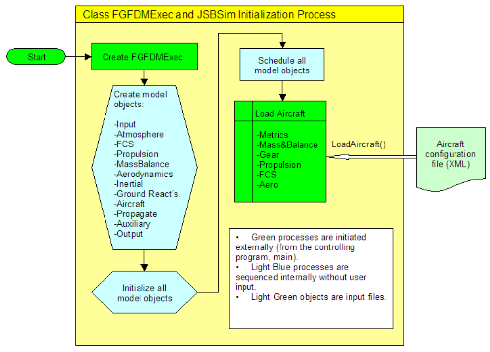

# JSBSim Note 

**Note the crucial terms about JSBSim open-source code**

Thư mục ./src/ gồm các thư mục con sau:
*  initialization
*  input_output
*  math 
*  models
*  simgear
*  utilities
  
## 1. Executive class 
At the time of simulation initialization, the interface class (or, broadly: the application that is "calling" JSBSim) creates an instance of this executive class: 
> fdmex = new FGFDMExec( … ); // (1) Instantiation \
result = fdmex->LoadModel( … ); // (2) Model loading

When FGFDMExec is instantiated (see (1), in the above code snippet), several actions are taken within the FGFDMExec class as the constructor for FGFDMExec is called, creating an instance of FGFDMExec:
* The subsystem model classes (Atmosphere, Propulsion, Aircraft, etc.) are instantiated and initialized.
*  The subsystem models are scheduled - that is a list of models is made that will be called in order when each frame is cyclically processed

After the Executive is created, the aircraft model is loaded. When an aircraft model is loaded, the config file (the name of which is supplied in the LoadModel() function of the Executive class) is parsed and for each of the sections of the config file (propulsion, flight control, etc.) the corresponding Load() method is called (e.g. FGFCS::Load() is called to load the flight control system parameters). 

Fig 1: The JSBSim FGFDMExec class and initialization process 

Interface with another application, there are serveral methods to as following:

At initializing: 
> copy_to_JSBsim(); // copy control inputs to JSBSim \
fdmex->RunIC(); // loop JSBSim once w/o integrating \
copy_from_JSBsim(); // update the bus 

Once initialization is complete, cyclic execution proceeds:
> copy_to_JSBsim(); // copy control inputs to JSBSim \
fdmex->Run(); // execute JSBSim \
copy_from_JSBsim(); // update the bus 

## 2.  Các model class trên JSBSim

* Input
* Atmosphere
* FCS (a collection manager class)
* Propulsion (a collection manager class)
* MassBalance
* Aerodynamics (a collection manager class)
* Inertial
* GroundReactions (a collection manager class)
* Aircraft
* Propagate
* Auxiliary
* Output

### 2.1 Input (.src/input_output/)

Phương thức FGInput::Load() tạo ra một Instance FGfdmSocket và truyền vào Port number 

Trong runtime, phương thức FGInput::Run() được gọi, data được nhận qua Socket sẽ được phân giải và xử lý theo keyword thích hợp được định nghĩa theo mẫu trong file xml.

> typedef std::map <std::string, std::map <std::string, double> > tMapConvert;
  static tMapConvert convert;

### 2.2 Atmosphere (.src/models/atmosphere)

* Gió (Wind) và gió xoáy (Turlubents) 
* Nhiệt độ và áp suất được mô hình hóa theo độ cao (đúng với thực tế theo ngày giờ và tọa độ trên thực địa). Có 3 mô hình hóa bầu khí quyển bao gồm: MSIS Atmosphere Model, Mars Atmosphere Model và Standard Atmosphere Model. Với MSIS các tham số có thể tính toán nhanh tham khảo từ [MSIS-E-90 Atmosphere Model], các dữ liệu này là dữ liệu thu được ngoài thực tế vào đúng ngày giờ đó trong quá khứ. Thường thì dùng model chuẩn để mô hình hóa bầu khí quyển.
* Ngoài ra, nhiệt độ và áp suất còn được mô hình theo bầu khí quyển của sao Hỏa (Mars)

### 2.3  FCS(Flight Control System)

FCS class bao gồm những hàm Flight Control System (FCS). FCS gọi và đọc các giá trị là góc mở cánh lái và gas. Khi 

## **Hyper-link Reference** (Nothing display here!)
[MSIS-E-90 Atmosphere Model]: https://ccmc.gsfc.nasa.gov/modelweb/models/msis_vitmo.php

$$ E = mc^2$$